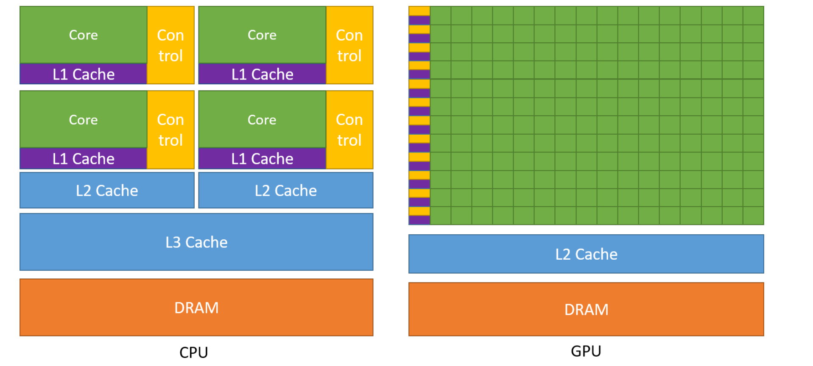
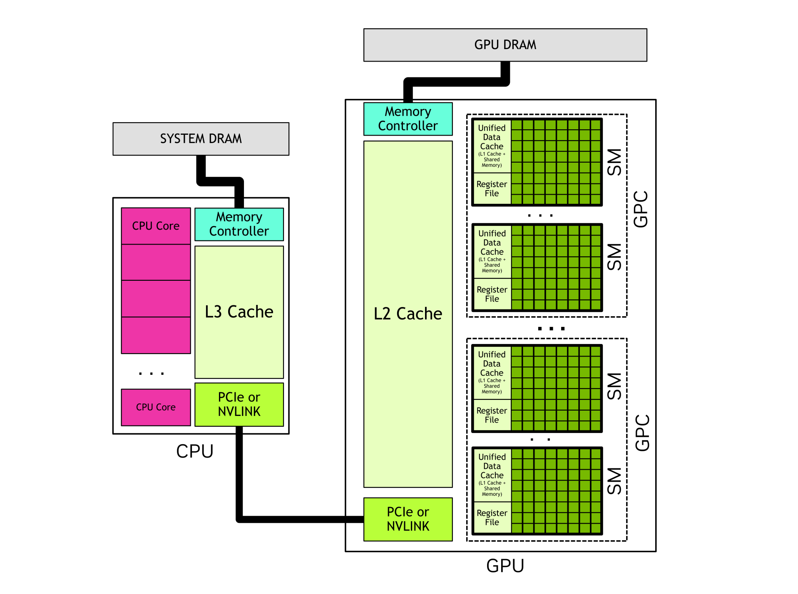
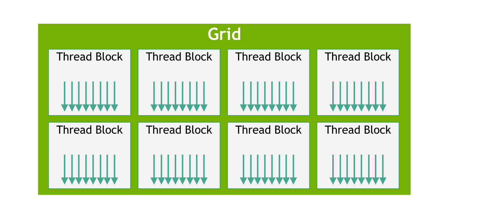
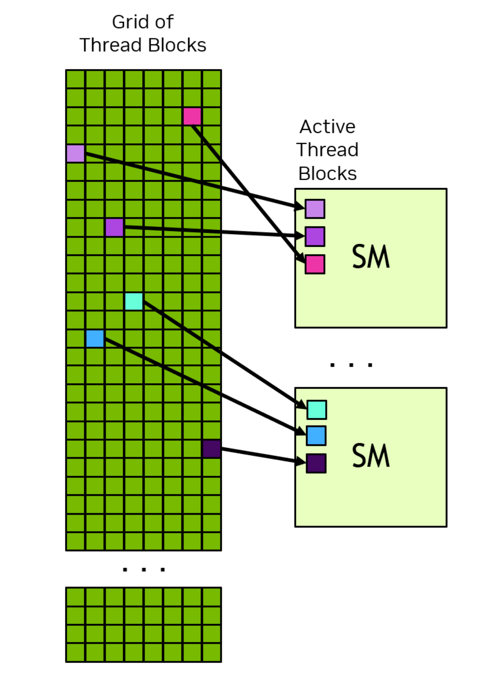
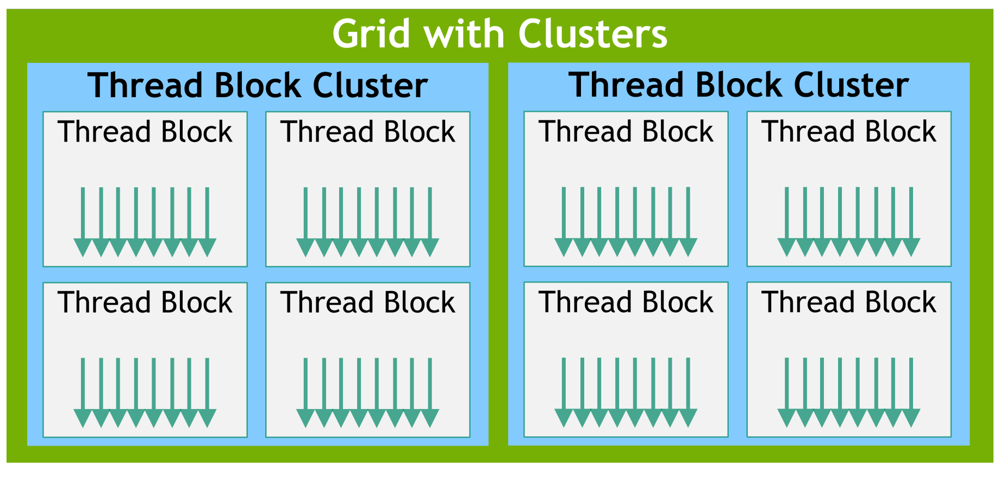
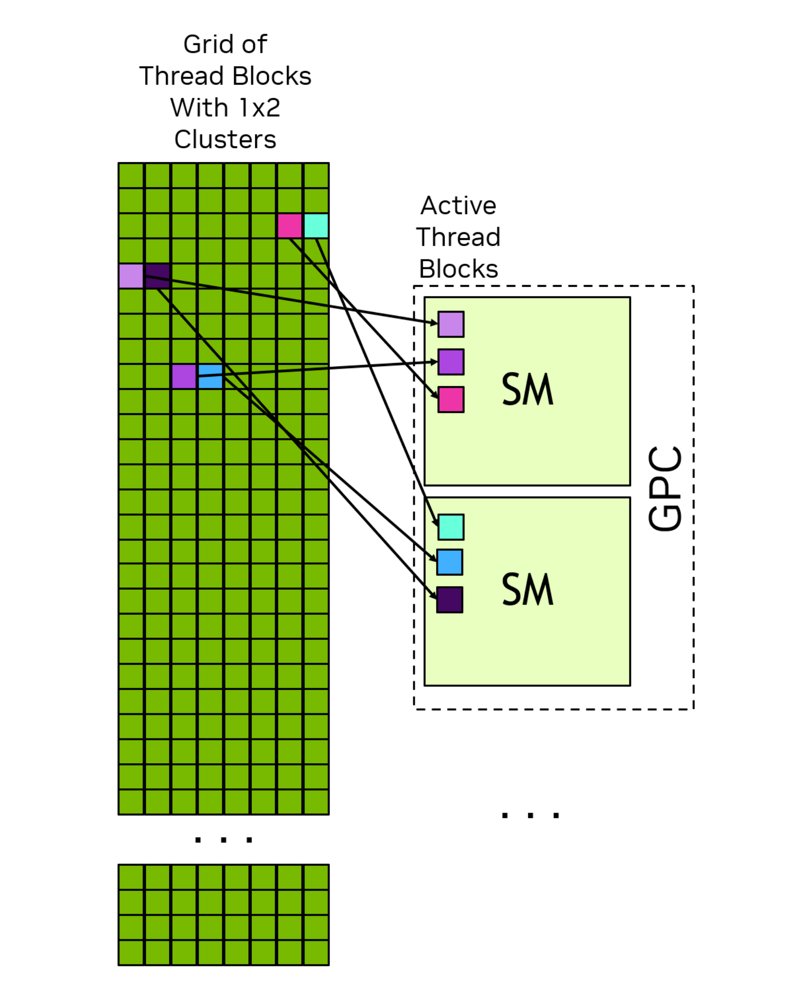
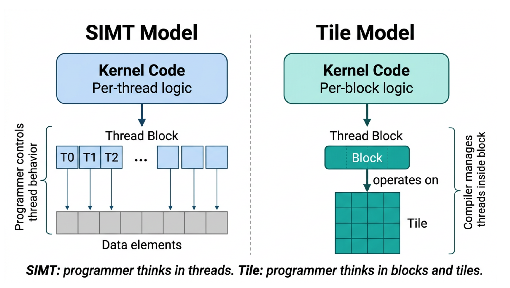

# cuda编程模型

CPU和GPU的架构对比，从下图可以发现CPU更加注重单个线程的性能能力，注重分支预测和缓存。一个CPU也是多核心，一般有几十个。作为对比，GPU通常会有成千上万的核心。

如下图，CPU中有一个内存控制器，GPU中也有一个显存控制器。SM是GPU中的流式多处理器，内部包含缓存L1和寄存器文件以及线程块。多个流式多处理器构成图形处理集群。CPU与GPU之间使用PCIe或者NVLINK连接保证高速通信。

在cuda的程序中，往往同时包含CPU程序和GPU程序，CPU程序是整个程序的入口提供基本的逻辑控制，被成为HOST。GPU程序是执行在GPU上的，跟CPU组成异构计算系统。一般的流程是数据在CPU上组织，然后拷贝到GPU，在CPU程序上把GPU程序配置好，等数据在GPU上计算完成再拷贝会CPU。并在CPU上进行其他的常规逻辑计算。由于历史原因，GPU上的程序被称为kernel，当程序启动一个kernel时，会启动GPU上的大量线程，这些线程被组织成快blocks，线程块又组成网格grid。一个grid的所有线程块大小维度相同。cuda提供内建变量，可以让每个线程知道自己在内存快中的位置，自己所属block在grid中的位置。每个线程都有自己的唯一身份。所有运行在同一个block上的线程会运行在同一个SM上，可以高效通信高效同步，可以通过共享片上的共享内存。

block之间不能假设依赖关系，cuda编程模型要求线程块必须能够以任意顺序执行——无论是并行执行还是串行执行都应当成立。下图中每一个格子表示一个block。

在计算能力9.0以上的GPU平台上提供高级cluster，指定cluster的作用，是将相邻的线程块归为同一个cluster，并在cluster层面提供额外的同步和通信能力。

换言之，正常情况下block是不能同步的，但是在同一个cluster中的block可以同步。在同一个cluster中的block会被同时启动和调度，可以通过软件接口合作组实现。位于cluster中的block可以访问同一个cluster中的所有block的共享内存。

单指令多线程SIMT，是同一个指令并行被多个线程同时执行。在线程块(thread block)内部，线程会被组织成由32个线程构成的组，称为warp。cuda鼓励逻辑上共同推进，因为比较新的版本相比于老版本，warp中的线程不再严格lock-step。比如在老版本y=1+x;z=1+y;在一个线程束内的线程是可以保证在执行第二条语句前执行完第一条语句的，但是在nvidia引入Independent Thread Scheduling后不再保证。需要使用线程束的人自己在必要的时候做同步。因为在第一句线程修改了y的数值，在第二句使用了这个值，需要保证数据读写的同步避免出现竟态。

warp是cuda高性能编程的非常核心的优化点。线程数量推荐使用32的整数倍，理论上可以是任意数量，在GPU上执行会按照整块去执行，如果线程不是32的整数倍，最有一个线程束中会有线程被轮空未使用，造成效率降低。

其实SIMT跟SIMD非常类似，只不过SIMD是在cpu中使用向量寄存器可以同时操纵数据，而SIMT操作的是GPU上的并行线程。

SIMT是程序员自己控制哪个线程做什么事情，而TILE是直接控制一个线程块处理，具体内部的细节由cuda自己做。这是更高级的层级，极致的效率肯定不如全部自己优化控制，不过已经可以提供非常好的常规性能表现了

在瓦片编程中，整个块执行统一的操作控制流。瓦片在cuda中是数据单元，block是执行单元。

